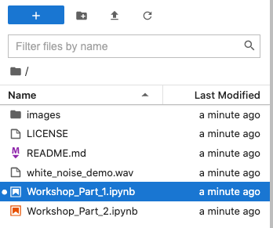

# Dolby.io Developer Days Media APIs Getting Started Application

## About this Workshop and Application

This example is designed to get participants working with the Dolby.io Media APIs.

For the purposes of this workshop, you'll need to sign-up to following platforms:

- [Dolby.io](https://dolby.io/signup)

## To get started:

[Click this to open the workshop in Binder](https://mybinder.org/v2/gh/dolbyio-samples/workshop-media-apis-getting-started/HEAD)

This may take a few seconds. Start by opening `Workshop_Part_1.ipynb` once it has launched:

